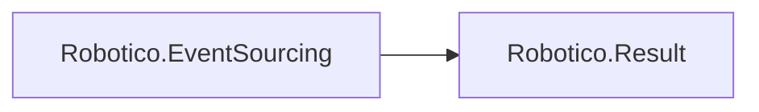

# Robotico.EventSourcing

[](https://dotnet.microsoft.com/download/dotnet/8.0)
[](https://dotnet.microsoft.com/download/dotnet/10.0)
[](https://github.com/robotico-dev/robotico-eventsourcing-csharp/packages)

Event sourcing: event store abstraction and aggregates that fold events. Result-based. Depends on Robotico.Result. Add when multiple bounded contexts share the same event-sourcing model.

## Robotico dependencies



## Installation

```bash
dotnet add package Robotico.EventSourcing
```

## License

See repository license file.
