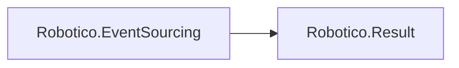

# Robotico.EventSourcing

[](https://github.com/robotico-dev/robotico-eventsourcing-csharp/actions/workflows/publish.yml)
[](https://dotnet.microsoft.com/download/dotnet/8.0)
[](https://dotnet.microsoft.com/download/dotnet/10.0)
[](https://github.com/robotico-dev/robotico-eventsourcing-csharp/packages)

Event sourcing: event store abstraction and aggregates that fold events. Result-based. Depends on Robotico.Result. Add when multiple bounded contexts share the same event-sourcing model.

## Robotico dependencies



## Installation

```bash
dotnet add package Robotico.EventSourcing
```

## Quick start

Implement `IEventStore<TId, TEvent>`. Append events to a stream; read events in order to rebuild state. See `docs/design.adoc` for stream semantics and aggregate integration.

## Documentation

Design docs (AsciiDoc) are in the `docs/` folder:

- **Design** (`docs/design.adoc`) — Event sourcing, API contract, stream identity and ordering, related packages.
- **Index** (`docs/index.adoc`) — Quick links and how to build the docs.

To build HTML: `asciidoctor docs/index.adoc -o docs/index.html` and `asciidoctor docs/design.adoc -o docs/design.html`.

## Building and testing

```bash
dotnet restore
dotnet build -c Release
dotnet test -c Release --collect:"XPlat Code Coverage"
```

## Related packages

- **Robotico.Domain** — Use IEntity&lt;TId&gt; for aggregate roots that produce and fold events.
- **Robotico.Events** — Dispatch domain events via IEventDispatcher after appending.
- **Robotico.Repository** — Persist snapshots to avoid replaying full streams.

## License

See repository license file.
